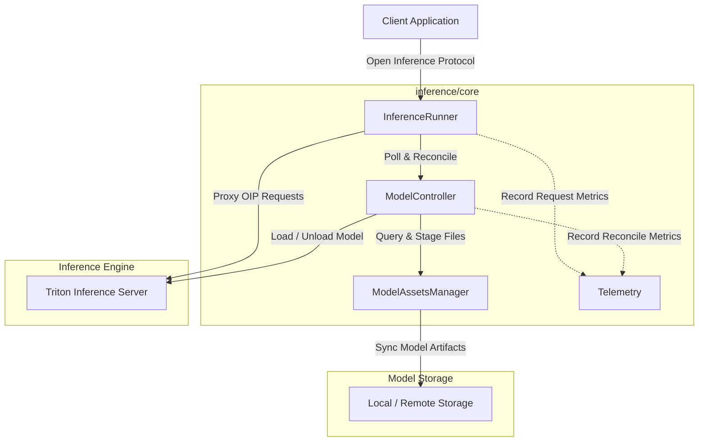
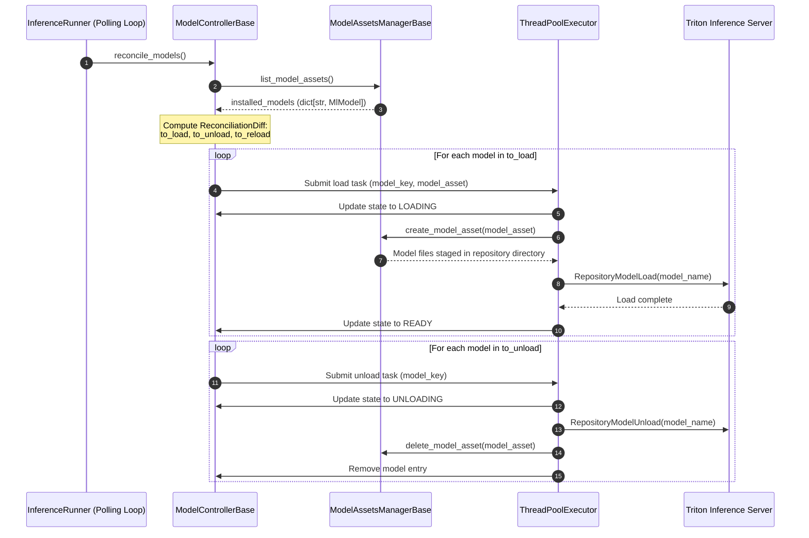

<!--
Copyright 2026 Intrinsic Innovation LLC

Licensed under the Apache License, Version 2.0 (the "License");
you may not use this file except in compliance with the License.
You may obtain a copy of the License at

    https://www.apache.org/licenses/LICENSE-2.0

Unless required by applicable law or agreed to in writing, software
distributed under the License is distributed on an "AS IS" BASIS,
WITHOUT WARRANTIES OR CONDITIONS OF ANY KIND, either express or implied.
See the License for the specific language governing permissions and
limitations under the License.
-->
# Inference Core Components

The `inference/core` folder contains backend-agnostic, reusable building blocks
for managing ML inference lifecycle, model asset synchronization, state
reconciliation, and gRPC proxying. These core mechanisms power both ROS-based
and local inference environments.

---

## System Architecture

The core inference architecture decouples model staging on disk
(`ModelAssetsManagerBase`), desired vs. actual model state reconciliation
(`ModelControllerBase`), and gRPC request proxying (`InferenceRunner`).

---

## Core Mechanisms & Layers

### 1. Service & Polling Orchestration (`InferenceRunner`)

`InferenceRunner` (`inference_runner.py`) is the primary orchestration entry
point for running inference services:

-   **Server Readiness Verification**:
    -   Before initiating background reconciliation, `start()` verifies that the
    target inference backend reports live (`ServerLive`) and ready
    (`ServerReady`).
-   **Background Model Polling Loop**:
    -   Spawns a daemon polling thread that runs at a configurable interval
    (`poll_models_interval`, defaulting to 5 seconds). On each tick, it calls
    `ModelControllerBase.reconcile_models()` and updates `installed_models`.
-   **Thread-Safe Proxying**:
    -   Acts as an Open Inference Protocol proxy, directly forwarding gRPC
    requests (`ModelInfer`, `ModelMetadata`, `ServerMetadata`, `ModelReady`)
    to the backend server stub.

### 2. Model Reconciliation & State Control (`ModelControllerBase` & `ModelControllerTriton`)

The model controller (`model_controller_base.py`) is responsible for reconciling
the set of currently loaded models against the desired set of models. The
precise behavior of this is dependent on the concrete `model_assets_manager`
implementation. For example, in `ModelAssetsManagerLocalRepo` the desired set of
models would be detected by checking which model files are present in a local
directory. The newly detected models would then be loaded, models that are
not detected anymore unloaded and models with a new version reloaded.

#### Model State Lifecycle

Each tracked model maintains a thread-safe `ModelAndState` object with one of
the following states (`ModelState`):

-   `LOADING`: The model is being downloaded/staged on disk or loaded into the
    inference engine.
-   `READY`: The model is loaded in the backend and ready to serve inference
    requests.
-   `RELOADING`: The model configuration or files changed and are being updated
    in place.
-   `UNLOADING`: The model is being removed from the inference engine and
    deleted from local staging storage.
-   `FAILED`: An error occurred during loading, reloading, or validation.

#### Differential Reconciliation Workflow

When `reconcile_models()` is called:

1.   **Discovery**: Queries `ModelAssetsManagerBase.list_model_assets()` for the
    desired set of installed model assets.
2.   **Diffing**: Computes a `ReconciliationDiff` (`to_load`, `to_unload`,
    `to_reload`) comparing existing models against desired models.
3.   **Concurrent Execution**: Submits individual asynchronous load, unload, and
    reload tasks to an internal `ThreadPoolExecutor`.
4.   **Backend Loading**: Backend-specific subclasses handle model loading,
    unloading, and reloading. For example, `ModelControllerTriton`
    (`model_controller_triton.py`):

-   Validates that `model_asset.backend_config` contains a Triton `ModelConfig`
    message.
-   Stages files into the Triton repository directory via
    `ModelAssetsManagerBase.create_model_asset()`.
-   Issues explicit gRPC management calls (`RepositoryModelLoad` /
    `RepositoryModelUnload`) to Triton.

### 3. Model Asset Staging (`ModelAssetsManagerBase` & Factory)

`ModelAssetsManagerBase` (`model_assets_manager_base.py`) defines an abstract
interface for discovering and managing model artifact files on the local filesystem:

-   **Lifecycle Operations**:
    -   `list_model_assets()`: Enumerate available `MlModel` protos keyed by
        `package.name.version` (or `name.version`).
    -   `create_model_asset(ml_model)`: Download or stage files into the target
        repository path.
    -   `update_model_asset(old_model, new_model)`: Perform differential updates
        (removing unneeded files and downloading modified artifacts).
    -   `delete_model_asset(ml_model)`: Remove model files from local storage.
-   **Pluggable Implementations**:
    -   `ModelAssetsManagerLocalRepo` (`model_assets_manager_local_repo.py`):
        Scans local directory structures containing textproto manifests and
        model directories.
    -   Custom managers can be registered and instantiated dynamically via
        `ModelAssetsManagersFactory` (`model_assets_managers_factory.py`).

### 4. Observability & Tracing (`TelemetryBase`, `TelemetryOtel`, `SimpleTracer`)

-   **Telemetry Abstraction (`telemetry_base.py`)**: Provides uniform interfaces
    for recording model load/unload counters, reconciliation errors, and request
    latencies.
-   **OpenTelemetry Implementation (`telemetry_otel.py`)**: Implements
    `TelemetryBase` using OpenTelemetry metrics (`MeterProvider`, histograms,
    and counters).
-   **Tracing (`simple_tracer.py`)**: Lightweight context managers and
    decorators for instrumenting latency and error spans across asynchronous
    workflows.
