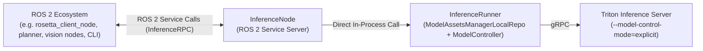

<!--
Copyright 2026 Intrinsic Innovation LLC

Licensed under the Apache License, Version 2.0 (the "License");
you may not use this file except in compliance with the License.
You may obtain a copy of the License at

    https://www.apache.org/licenses/LICENSE-2.0

Unless required by applicable law or agreed to in writing, software
distributed under the License is distributed on an "AS IS" BASIS,
WITHOUT WARRANTIES OR CONDITIONS OF ANY KIND, either express or implied.
See the License for the specific language governing permissions and
limitations under the License.
-->
# ROS 2 InferenceNode

`InferenceNode` is a ROS 2 lifecycle/service wrapper that embeds
`InferenceRunner` and exposes all OpenInferenceProtocol (OIP) RPC endpoints
directly as ROS 2 services.

For an overview of the core inference engine, controllers, and asset managers,
see [`intrinsic_inference/core/`](../core).

---

## Architecture & Design

`InferenceNode` bridges the ROS 2 ecosystem with high-performance model serving
backends (like NVIDIA Triton):

1.   **In-Process Inference Engine**: Directly manages `InferenceRunner`,
  handling model asset reconciliation, lifecycle states, and optional shared
  memory (SHM).
2.   **OpenInferenceProtocol over ROS 2**: Exposes 6 standard OIP endpoints as
  ROS 2 services:

-   `/ServerLive`
-   `/ServerReady`
-   `/ModelReady`
-   `/ServerMetadata`
-   `/ModelMetadata`
-   `/ModelInfer`

1.   **Unified Communication Interface with Serialized Protos**: Currently, all
  endpoints use a single, unified `InferenceRPC.srv` service definition that
  passes serialized Protobuf request and response bytes directly across ROS 2.
  *(Note: Dedicated per-endpoint `.srv` files may replace this generic interface
  in future releases).*



---

## Quickstart Guide

### 1. Setup Model Repository & Start Triton Server

`InferenceRunner` uses `ModelAssetsManagerLocalRepo` to scan and manage models
from a local directory.

> **Important**: Triton **must** be launched with
`--model-control-mode=explicit`. This allows `ModelControllerTriton` to
dynamically load, unload, and hot-reload models via gRPC without Triton
conflicts.
>
> For more details on Triton, see the [NVIDIA Triton Quickstart Guide](https://docs.nvidia.com/deeplearning/triton-inference-server/user-guide/docs/getting_started/quickstart.html).

#### Create a Demo Model Repository (`densenet_onnx`)

```bash
# Create local directory as repository
mkdir -p /tmp/test_ros_inference_node_model_repo/densenet_onnx/1

# Fetch model config
curl -sL https://github.com/triton-inference-server/server/archive/refs/heads/main.tar.gz \
  | tar -xz -C /tmp/test_ros_inference_node_model_repo/densenet_onnx --strip-components=5 server-main/docs/examples/model_repository/densenet_onnx

# Fetch model weights
wget -O /tmp/test_ros_inference_node_model_repo/densenet_onnx/1/model.onnx \
  https://github.com/onnx/models/raw/main/validated/vision/classification/densenet-121/model/densenet-7.onnx
```

#### Start Triton Server in Docker

```bash
docker run --rm \
  -p 8000:8000 -p 8001:8001 -p 8002:8002 \
  -v /tmp/test_ros_inference_node_model_repo:/models \
  nvcr.io/nvidia/tritonserver:26.07-py3 \
  tritonserver \
    --model-repository=/models \
    --model-control-mode=explicit
```

---

### 2. Connect ROS 2 Service Interfaces (`inference_interfaces`)

To make `InferenceRPC.srv` visible to your external ROS 2 / Colcon environment
(e.g. `demos/`):

```bash
# Symlink package from the intrinsic_inference repo into demos workspace
ln -sfn <full_path_to>/intrinsic_inference/ros/inference_interfaces <full_path_to>/demos/external/inference_interfaces

# Build the interface package in your ROS environment (e.g. inside Pixi)
cd <full_path_to>/demos
pixi run colcon build --symlink-install --packages-select inference_interfaces
source install/setup.bash
```

---

### 3. Launch `InferenceNode`

In your `intrinsic-inference` repository workspace:

```bash
cd /path/to/intrinsic-inference

# Ensure CycloneDDS is used (bundled with rules_ros2)
export RMW_IMPLEMENTATION=rmw_cyclonedds_cpp

# Run InferenceNode
bazel run -c opt //intrinsic_inference/ros/inference_node:inference_node_main -- \
    --repo_path=/tmp/test_ros_inference_node_model_repo \
    --triton_grpc_url=127.0.0.1:8001
```

Note: See [Middleware Compatibility Note](#middleware-compatibility-note) for
more details on CycloneDDS.

---

### 4. Verify & Test with ROS 2 CLI

In your client terminal (e.g., inside `pixi shell` in `demos`):

```bash
# Important: Ensure the client uses the same middleware
export RMW_IMPLEMENTATION=rmw_cyclonedds_cpp

# 1. Check Service Registration
ros2 service type /ServerLive
# Returns: inference_interfaces/srv/InferenceRPC

ros2 interface show inference_interfaces/srv/InferenceRPC
# Returns:
#   uint8[] raw_request
#   ---
#   bool success
#   string error_message
#   uint8[] raw_response

# 2. Test Server Liveness (/ServerLive)
ros2 service call /ServerLive inference_interfaces/srv/InferenceRPC "{raw_request: []}"
# Response: success=True, raw_response=[8, 1]

# 3. Query Model Metadata for densenet_onnx (/ModelMetadata)
# Encoded proto payload: name: "densenet_onnx", version: "1"
ros2 service call /ModelMetadata inference_interfaces/srv/InferenceRPC "{raw_request: [10, 13, 100, 101, 110, 115, 101, 110, 101, 116, 95, 111, 110, 110, 120, 18, 1, 49]}"
```

---

## Service Definition & Message Format

Location: [`intrinsic_inference/ros/inference_interfaces/srv/InferenceRPC.srv`](../inference_interfaces/srv/InferenceRPC.srv)

```idl
uint8[] raw_request
---
bool success
string error_message
uint8[] raw_response
```

### Workflow

1.   **Request**: The client serializes a standard OpenInferenceProtocol
  Protobuf request (`ServerLiveRequest`, `ModelInferRequest`, etc.) into
  `raw_request` bytes.
2.   **Execution**: `InferenceNode` parses the bytes into the corresponding
  Protobuf, forwards the call to `InferenceRunner`, and executes the backend
  inference.
3.   **Response**: The Protobuf response is serialized into `raw_response` bytes
   with `success = True`. If any error occurs during deserialization or
   execution, `success = False` and `error_message` is populated.

---

## Middleware Compatibility Note

-   `InferenceNode` built via Bazel (`rules_ros2`) is compiled with
  **`rmw_cyclonedds_cpp`**.
-   Always ensure your ROS 2 client environment sets:

  ```bash
  export RMW_IMPLEMENTATION=rmw_cyclonedds_cpp
  ```

  *(If using Pixi, may need to ensure `ros-kilted-rmw-cyclonedds-cpp` /
  `ros-jazzy-rmw-cyclonedds-cpp` is installed in `pixi.toml`).*

---

## Running Automated Unit Tests

Unit tests can be run via Bazel:

```bash
# Standard test run. Can use --test_output=all to stream full execution logs.
bazel test //intrinsic_inference/ros/inference_node:inference_node_test
```
