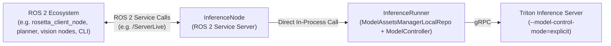

<!--
Copyright 2026 Intrinsic Innovation LLC

Licensed under the Apache License, Version 2.0 (the "License");
you may not use this file except in compliance with the License.
You may obtain a copy of the License at

    https://www.apache.org/licenses/LICENSE-2.0

Unless required by applicable law or agreed to in writing, software
distributed under the License is distributed on an "AS IS" BASIS,
WITHOUT WARRANTIES OR CONDITIONS OF ANY KIND, either express or implied.
See the License for the specific language governing permissions and
limitations under the License.
-->
# ROS 2 InferenceNode

`InferenceNode` is a ROS 2 lifecycle/service wrapper that embeds
`InferenceRunner` and exposes all OpenInferenceProtocol (OIP) RPC endpoints
directly as ROS 2 services.

For an overview of the core inference engine, controllers, and asset managers,
see [`intrinsic_inference/core/`](../core).

---

## Architecture & Design

`InferenceNode` bridges the ROS 2 ecosystem with high-performance model serving
backends (like NVIDIA Triton):

1.   **In-Process Inference Engine**: Directly manages `InferenceRunner`,
  handling model asset reconciliation, lifecycle states, and optional shared
  memory (SHM).
2.   **OpenInferenceProtocol over ROS 2**: Exposes OIP-based endpoints as ROS 2
  services:

-   `/ServerLive`
-   `/ServerReady`
-   `/ModelReady`
-   `/ModelMetadata`
-   `/ModelInfer`

See [`intrinsic_inference/ros/inference_interfaces/`](../inference_interfaces/)
for interface definitions.



---

## Quickstart Guide

### 1. Setup Model Repository & Start Triton Server

`InferenceRunner` uses `ModelAssetsManagerLocalRepo` to scan and manage models
from a local directory.

> **Important**: Triton **must** be launched with
`--model-control-mode=explicit`. This allows `ModelControllerTriton` to
dynamically load, unload, and hot-reload models via gRPC without Triton
conflicts.
>
> For more details on Triton, see the [NVIDIA Triton Quickstart Guide](https://docs.nvidia.com/deeplearning/triton-inference-server/user-guide/docs/getting_started/quickstart.html).

#### Create a Demo Model Repository (`densenet_onnx`)

```bash
# Create local directory as repository
mkdir -p /tmp/test_ros_inference_node_model_repo/densenet_onnx/1

# Fetch model config
curl -sL https://github.com/triton-inference-server/server/archive/refs/heads/main.tar.gz \
  | tar -xz -C /tmp/test_ros_inference_node_model_repo/densenet_onnx --strip-components=5 server-main/docs/examples/model_repository/densenet_onnx

# Fetch model weights
wget -O /tmp/test_ros_inference_node_model_repo/densenet_onnx/1/model.onnx \
  https://github.com/onnx/models/raw/main/validated/vision/classification/densenet-121/model/densenet-7.onnx
```

#### Start Triton Server in Docker

```bash
docker run --rm \
  -p 8000:8000 -p 8001:8001 -p 8002:8002 \
  -v /tmp/test_ros_inference_node_model_repo:/models \
  nvcr.io/nvidia/tritonserver:26.07-py3 \
  tritonserver \
    --model-repository=/models \
    --model-control-mode=explicit
```

---

### 2. Launch `InferenceNode`

In your `intrinsic-inference` repository workspace:

```bash
cd /path/to/intrinsic-inference

# Ensure CycloneDDS is used (bundled with rules_ros2)
export RMW_IMPLEMENTATION=rmw_cyclonedds_cpp

# Run InferenceNode
bazel run -c opt //intrinsic_inference/ros/inference_node:inference_node_main -- \
    --repo_path=/tmp/test_ros_inference_node_model_repo \
    --triton_grpc_url=127.0.0.1:8001
```

Note: See [Middleware Compatibility Note](#middleware-compatibility-note) for
more details on CycloneDDS.

---

### 3. Connect ROS 2 Service Interfaces (`inference_interfaces`)

To make the custom OIP-based interfaces [`inference_interfaces/`](../inference_interfaces/)
visible to your external ROS 2 / Colcon environment (e.g. `demos/`):

```bash
cd <full_path_to>/demos

# Symlink package from the intrinsic_inference repo into demos workspace ("external/" folder)
ln -sfn <full_path_to>/intrinsic_inference/ros/inference_interfaces external/inference_interfaces

# Import external dependencies (tensor_msgs)
pixi run vcs import < external/inference_interfaces/dependencies.repos

# Build the interface package and its dependencies in your ROS environment (e.g. inside Pixi)
pixi run colcon build --symlink-install --packages-up-to inference_interfaces
source install/setup.bash
```

---

### 4. Verify & Test with ROS 2 CLI

In your client terminal (e.g., inside `pixi shell` in `demos`):

```bash
# Launch pixi environment
pixi shell

# Important: Ensure the client uses the same middleware
export RMW_IMPLEMENTATION=rmw_cyclonedds_cpp

# View availble ROS services
ros2 service list
# Returns:
#   /inference_node/describe_parameters
#   /inference_node/get_parameter_types
#   /inference_node/get_parameters
#   /inference_node/list_parameters
#   /inference_node/model_infer
#   /inference_node/model_metadata
#   /inference_node/model_ready
#   /inference_node/server_live
#   /inference_node/server_ready
#   /inference_node/set_parameters
#   /inference_node/set_parameters_atomically

# Check Service Registration
ros2 service type /inference_node/server_live
# Returns: inference_interfaces/srv/ServerLive

ros2 interface show inference_interfaces/srv/ServerLive
# Returns:
#   # Query ServerLive status of the inference server
#
#   ---
#   bool success
#   string error_message
#   bool live

# Test Server Liveness (/inference_node/server_live)
ros2 service call /inference_node/server_live inference_interfaces/srv/ServerLive "{}"
# Returns:
#   ...
#   response:
#   inference_interfaces.srv.ServerLive_Response(success=True, error_message='', live=True)

# Query Model Metadata for densenet_onnx (/ModelMetadata)
ros2 service call /inference_node/model_metadata inference_interfaces/srv/ModelMetadata "{model_name: 'densenet_onnx', model_version: '1'}"
```

---

## Middleware Compatibility Note

-   `InferenceNode` built via Bazel (`rules_ros2`) is compiled with
  **`rmw_cyclonedds_cpp`**.
-   Always ensure your ROS 2 client environment sets:

  ```bash
  export RMW_IMPLEMENTATION=rmw_cyclonedds_cpp
  ```

  This allows all systems to align in using the same middleware protocol,
  since ROS 2 nodes can only discover and communicate with each other
  when using the exact same middleware protocol.

---

## Running Automated Unit Tests

Unit tests can be run via Bazel:

```bash
# Standard test run. Can use --test_output=all to stream full execution logs.
bazel test //intrinsic_inference/ros/inference_node:inference_node_test
```
